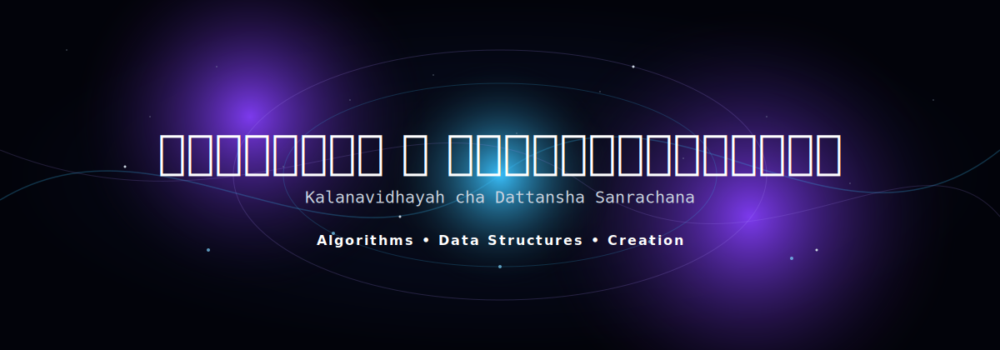

# Kalanavidhayah Cha Dattansha Sanrachanah

**कलनविधयः च दत्तांशसंरचनाः** — Sanskrit for **Algorithms and Data Structures**.

A collection of algorithms, data structures, and computer science concepts for learning, practice, and exploration.
